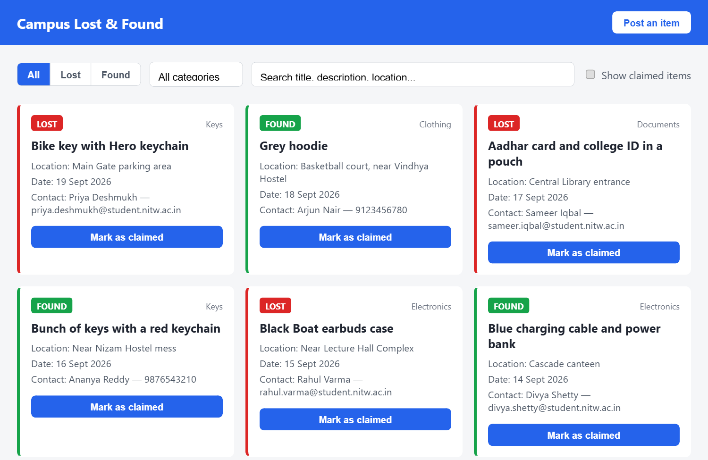

# Campus Lost & Found Portal

A web app for a college campus where students post items they've lost or
found, search what others have posted, and mark an item as claimed once it's
returned. Built for NIT Warangal students as a replacement for scattered
WhatsApp group messages that get buried within a day.

There's no login, no roles, and no admin — anyone can post, anyone can
search, and the person who posted an item marks it claimed.



## Stack

- **Frontend:** plain HTML, CSS, and vanilla JavaScript — no framework, no
  build step.
- **Backend:** Node.js + Express.
- **Storage:** a JSON file (`data/items.json`), read and written with `fs` —
  no database.

## Running it

```bash
npm install
node server.js
```

Then open `http://localhost:3000`.

## Deployment

Live at: **https://campus-lost-and-found-r8jx.onrender.com**

Hosted on [Render](https://render.com)'s free tier, deploying straight from
this repo (`npm install` as the build command, `npm start` to run it).
Since the free tier has no persistent disk, `data/items.json` resets back
to the seed data whenever the service restarts or redeploys — item posts
and claims made on the live site won't survive that. This is a known
tradeoff of keeping storage as a plain JSON file (see "Possible next steps"
below), not a bug.

Free-tier services also spin down after periods of inactivity, so the
first request after a while can take 30–60 seconds to wake it back up.

## API

| Method | Path              | Purpose |
|--------|-------------------|---------|
| POST   | `/api/items`      | Create a new lost or found item. Validates required fields, returns 400 with a useful message on bad input. |
| GET    | `/api/items`      | List items. Supports query params: `type`, `category`, `status`, `q` (free-text search across title, description and location). Filters combine with AND. Newest first. |
| PATCH  | `/api/items/:id`  | Update an item's status to `claimed`. 404 if the id doesn't exist. |

## Possible next steps

Out of scope for v1, but worth considering later:

- Authentication and user accounts, so only the original poster can mark
  their own item as claimed.
- A real database instead of a JSON file, for concurrent writes at scale
  and to avoid storing photos as base64 text inside it.
- Email or push notifications when a matching item is posted.
- Admin moderation for spam or duplicate posts.
